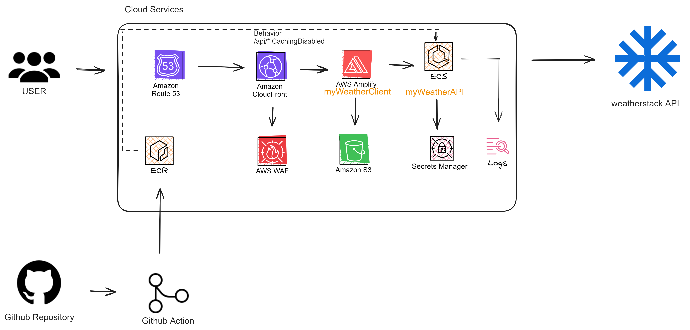

# myWeather

This is 1st time I combined ReactJS with .NET Core. In case like this, I often use NodeJS rather than .NET because I think the MERN stack will be suitable choice in many ways!



## Prerequisites
- Clone this repository
- (Windows only) Install Visual Studio. Visual Studio contains tooling support for .NET Aspire that you will want to have. [Visual Studio 2022 version 17.10 Preview](https://visualstudio.microsoft.com/vs/preview/).
  - During installation, ensure that the following are selected:
    - `ASP.NET and web development` workload.
    - `.NET Aspire SDK` component in `Individual components`.
- Install the latest [.NET 8 SDK](https://github.com/dotnet/installer#installers-and-binaries)


## Running the solution

> [!WARNING]
> Remember to ensure that Docker is started

* (Windows only) Run the application from Visual Studio:
 - Open the `myWeather.sln` file in Visual Studio
 - Ensure that `myWatherAPI` and `myweatherclient` is your startup project
 - Hit F5 to launch

* Or run the application from your terminal with Docker:
    * xUnit
```powershell
cd be
```
    * Without xUnit
```powershell
cd be\myWeatherAPI
```

```powershell
docker build -t my-weather-image .
```

```powershell
docker run -p 8080:80 my-weather-image:latest
```

then look for lines like this in the console output in order to find the URL to open the front-end application:
```sh
Now listening on: http://localhost:xxxx
```


## Techstack
- Backend: .NET Core 8.0 LTS with
- Frontend: ReactJS with Axios, Ant Design
- Infra: Docker with xUnit for unit test


## Thing to do for improve
- Add API Gateway: AWS API Gateway, or Kong/ ShenYu, Ocelot if you're using on-premise infra.
- Store API Access key on Vault or AWS Secrets Manager.
- Cloud Infra: Route53, Cloudfront, Amplify, API Gateway, Lambda, Amazon ElastiCache